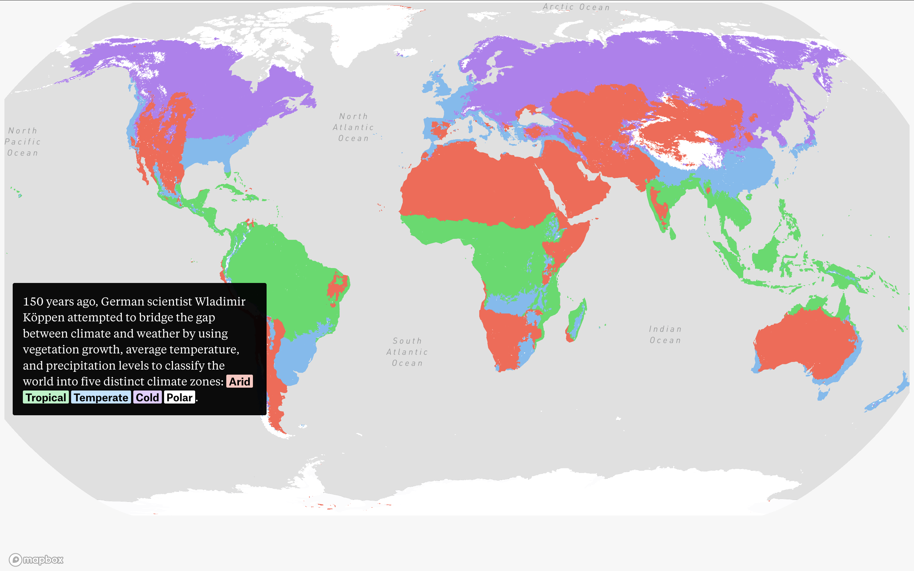

# Analisis web story

#### Nombre web story: CLIMATE ZONES  

https://pudding.cool/2024/06/climate-zones/

## Descripción de la historia que cuenta

La web story "Climate zones" es del sitio web The Pudding. Esta narra a los lectores las consecuencias que el cambio climático tendrá en un futuro (exactamente en 45 años) para el planeta y para las ciudades en las cuales habitan las personas. 

La narración comienza comentándole a los lectores que, según científicos climáticos, las temperaturas irán aumentando 2 grados como mínimo a lo largo del tiempo. A partir de esa idea, se plantea que quizás como personas corrientes no logremos entender las consecuencias de eso, y por lo tanto, la web story busca explicarlo a través de gráficas.

Lo que sigue vendría siendo la explicación del modelo de organización de las zonas climáticas, creado por Wladimir Köppen hace 150 años atrás aprox. Acá se establece que el mundo se divide en 5 zonas distintas: troópico, árido, temperado, frío y polar. 

Luego, la web story se sigue desarrollando a partir de un estudio de 2018, dirigido por el climatólogo Hylke Beck, quien utilizó datos proyectados de modelos climáticos para dar una idea de cómo podría verse y sentirse nuestro mundo en 2070. 

A partir de eso, el narrador nos cuenta que habrán muchas modificaciones, en donde pasará que diversas ciudades migraran de la categoría en la que están establecidas a día de hoy (tropical, frío, etc.) a otras totalmente opuestas. Esto, podría causar muchas consecuencias negativas para nosotras las personas, ya que nuestro estilo de vida deberá cambiar drásticamente, y podría incluso terminar con la posibilidad de vivir en algunos lugares. 

## Por qué me pareció interesante y qué aspectos destacaría de su estructura narrativa.

La web story "climate zones" me pareció interesante porque aborda un tema complejo e importante (al menos para mi) como lo es el cambio climático y la extinción de nuestro planeta. Creo que además de eso, algo que me pareció super interesante fue la manera en que la web le entrega la información al lector, es innovadora y transforma la información a una mucho más interesante, simplemente porque se vuelve más cómoda de leer y entender. Me pareció interesante también el uso de colores para representar ideas y/o conceptos, como por ejemplo asociar colores a las zonas climáticas y luego pintar el mapa mundi con esos colores, dándole a entender al lector que lugares entran en que categoría.

Su estructura narrativa es muy completa, a pesar de ser breve. Parte de lo más general, que vendría siendo el hecho de que nuestro planeta cambiará, a la información más específica como lo es el desplazamiento de cada lugar a una nueva categoría. Además, la información siempre se ve complementada de aspectos gráficos y visuales, lo cual rescato mucho. Por ejemplo, cuando se quiere explicar la clasificación de las 5 zonas climáticas en todo el mundo, se hace a través de un breve texto y la gráfica; nada más.

Esto hace que el lector no se pierda ni desvíe de la idea que se quiere explicar, por lo tanto diría que su estructura narrativa está bien delimitada y es precisa. 

## Evaluación de la efectividad para transmitir información.

A mi parecer, la efectividad de este formato específico que vemos en esta story web es muy alta. Me parece que todo lo escrito está demostrado de manera gráfica, por lo tanto es más fácil que un lector la entienda y pueda retenerla en la mente, ya que al tener esta dinámica en donde todo lo escrito está representado visualmente, aumenta la posibilidad de que diversos lectores la entiendan, ya que abarca dos formas principales en las que las personas entienden algo, leyéndolo o viéndolo. 
